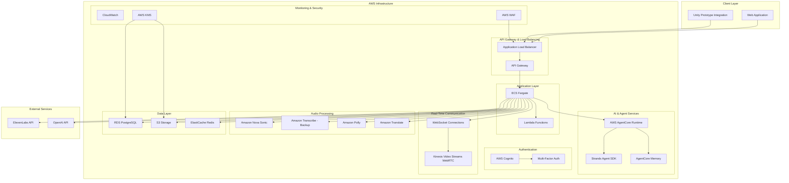
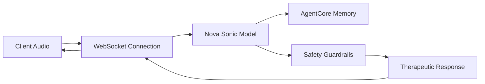

# Design Document: AI Therapy Platform

## Overview

The AI Therapy Platform is a secure, GDPR-compliant web application that enables real-time audio therapy sessions between clients and AI-powered therapists. The system leverages AWS AgentCore for AI agent management with persistent memory, Strands Agent SDK for conversation capabilities, and implements comprehensive safety features including red flag detection and therapist notifications.

The platform supports three user types (clients, therapists, admins) with role-based access controls, multi-language audio processing, and privacy-first design where therapists receive sentiment summaries rather than full conversation transcripts.

## Architecture

### High-Level Architecture



### Regional Deployment

- **Primary Region**: US-West-2 (Oregon) - Hackathon deployment
- **Multi-AZ Deployment**: High availability across availability zones
- **Note**: GDPR compliance features commented out for hackathon scope

### Nova Sonic Integration Details

**Amazon Nova Sonic** is a speech-to-speech generative AI model specifically designed for telephony and real-time voice applications. For the AI Therapy Platform, Nova Sonic provides:

**Key Capabilities**:
- **Real-time Processing**: Sub-200ms latency for natural conversation flow
- **Natural Turn-taking**: Understands conversation patterns and appropriate response timing
- **Multi-accent Support**: Handles various accents and speaking styles automatically
- **Therapeutic Context**: Can be configured with therapeutic system prompts and guardrails

**Integration Architecture**:


**Configuration for Therapy**:
- System prompts for therapeutic best practices
- Safety guardrails for harmful content detection
- Cultural sensitivity adaptations
- Integration with AgentCore memory for session continuity

**Fallback Strategy**:
- Primary: Nova Sonic for real-time speech-to-speech
- Fallback: Amazon Transcribe + Polly for specific language requirements
- Backup: Text-based interaction if audio processing fails

## Components and Interfaces

### 1. Authentication Service

**Technology**: AWS Cognito User Pools with MFA

**Responsibilities**:
- User registration and verification
- Multi-factor authentication (SMS, Email, TOTP)
- JWT token management
- Role-based access control (RBAC)
- Password reset and account recovery

**Key Features**:
- <!-- GDPR-compliant user management (commented out for hackathon) -->
- Adaptive authentication for risk detection
- Integration with external identity providers
- Session management with configurable timeouts

### 2. Web Application Frontend

**Technology**: React/TypeScript with WebRTC support

**Responsibilities**:
- User interface for all three user types
- Real-time audio communication setup
- Session management and history display
- Role-specific dashboards and controls

**Key Components**:
- Client session interface with audio controls
- Therapist dashboard with sentiment summaries
- Admin panel for user and system management
- Unity prototype integration components

### 3. API Gateway and Load Balancer

**Technology**: AWS Application Load Balancer + API Gateway

**Responsibilities**:
- Request routing and load distribution
- SSL/TLS termination
- Rate limiting and throttling
- API versioning and documentation
- CORS handling for web clients

**Security Features**:
- AWS WAF integration for DDoS protection
- Request validation and sanitization
- API key management for external services

### 4. Application Backend

**Technology**: Node.js/TypeScript on ECS Fargate

**Responsibilities**:
- Business logic orchestration
- Session management and coordination
- Red flag detection and alerting
- Sentiment analysis processing
- External API integration (OpenAI, ElevenLabs)

**Key Services**:
- Session orchestration service
- User management service
- Notification service
- Analytics and reporting service

### 5. AI Agent Integration

**Technology**: AWS AgentCore Runtime + Strands Agent SDK

**Responsibilities**:
- AI agent lifecycle management
- Conversation context persistence
- Therapeutic response generation
- Guardrails and safety filtering

**AgentCore Memory Integration**:
- Persistent conversation context across sessions
- Therapeutic progress tracking
- Personalized response adaptation
- Long-term memory management

### 6. Real-Time Communication

**Technology**: WebSocket + Amazon Kinesis Video Streams WebRTC

**Responsibilities**:
- Bi-directional streaming for real-time audio
- Low-latency communication (< 200ms)
- Connection management and recovery
- Audio quality optimization

**WebSocket Protocol**:
- Session establishment and teardown
- Audio chunk streaming
- Control message handling
- Connection health monitoring

### 7. Audio Processing Pipeline

**Technology**: Amazon Nova Sonic + Amazon Polly + Amazon Translate

**Nova Sonic Integration**:
- Real-time speech-to-speech AI model for telephony applications
- Low-latency voice conversations with natural turn-taking
- Built-in understanding of various accents and speaking styles
- Bidirectional streaming for real-time audio processing

**Multi-Language Support**:
- Automatic language detection via Nova Sonic
- Real-time speech-to-text conversion
- Text-to-speech synthesis in multiple languages
- Cultural adaptation for therapeutic responses

**Processing Flow**:
1. Audio input → Nova Sonic real-time processing
2. Speech-to-speech with AI response generation
3. Fallback to Transcribe + Polly for specific language requirements
4. Audio output with appropriate accent/intonation

### 8. Data Storage and Management

**Technology**: Amazon RDS PostgreSQL + Amazon S3 + ElastiCache Redis

**Data Architecture**:
- **PostgreSQL**: User profiles, session metadata, sentiment summaries
- **S3**: Audio recordings (encrypted), system logs, backups
- **Redis**: Session state, real-time data, caching

**Encryption**:
- Data at rest: AES-256 encryption
- Data in transit: TLS 1.3
- Key management: AWS KMS

<!-- GDPR Compliance Features (commented out for hackathon):
- Data residency controls
- Right to erasure implementation
- Data export functionality
- Consent management
-->

## Data Models

### User Model
```typescript
interface User {
  id: string;
  email: string;
  role: 'client' | 'therapist' | 'admin';
  profile: UserProfile;
  preferences: UserPreferences;
  createdAt: Date;
  updatedAt: Date;
  isActive: boolean;
  mfaEnabled: boolean;
  languagePreference: string;
}

interface UserProfile {
  firstName: string;
  lastName: string;
  timezone: string;
  phoneNumber?: string;
  emergencyContact?: EmergencyContact;
}

interface UserPreferences {
  language: string;
  voiceSettings: VoiceSettings;
  notificationSettings: NotificationSettings;
  privacySettings: PrivacySettings;
}
```

### Session Model
```typescript
interface TherapySession {
  id: string;
  clientId: string;
  agentId: string;
  status: 'active' | 'completed' | 'terminated';
  startTime: Date;
  endTime?: Date;
  duration?: number;
  language: string;
  metadata: SessionMetadata;
  sentimentSummary: SentimentSummary;
  redFlags: RedFlag[];
  agentMemoryId: string; // AgentCore memory reference
}

interface SessionMetadata {
  audioQuality: AudioQualityMetrics;
  connectionMetrics: ConnectionMetrics;
  therapeuticMilestones: string[];
  exercisesCompleted: string[];
}

interface SentimentSummary {
  overallSentiment: 'positive' | 'neutral' | 'negative';
  emotionalState: string[];
  progressIndicators: ProgressIndicator[];
  keyTopics: string[];
  riskLevel: 'low' | 'medium' | 'high';
  generatedAt: Date;
}
```

### Red Flag Model
```typescript
interface RedFlag {
  id: string;
  sessionId: string;
  type: 'self_harm' | 'suicidal_ideation' | 'abuse' | 'violence' | 'crisis';
  severity: 'low' | 'medium' | 'high' | 'critical';
  detectedAt: Date;
  context: string; // Sanitized context, not full transcript
  notificationsSent: NotificationRecord[];
  resolved: boolean;
  resolvedBy?: string;
  resolvedAt?: Date;
}

interface NotificationRecord {
  recipientId: string;
  method: 'email' | 'sms' | 'push' | 'in_app';
  sentAt: Date;
  acknowledged: boolean;
  acknowledgedAt?: Date;
}
```

### AgentCore Memory Model
```typescript
interface AgentMemory {
  memoryId: string;
  clientId: string;
  conversationContext: ConversationContext;
  therapeuticProfile: TherapeuticProfile;
  lastUpdated: Date;
  retentionPolicy: RetentionPolicy;
}

interface ConversationContext {
  sessionHistory: SessionSummary[];
  ongoingTopics: string[];
  therapeuticGoals: string[];
  progressNotes: ProgressNote[];
  personalityAdaptations: PersonalityAdaptation[];
}

interface TherapeuticProfile {
  communicationStyle: string;
  preferredApproaches: string[];
  triggersToAvoid: string[];
  successfulInterventions: string[];
  culturalConsiderations: string[];
}
```

Now I need to use the prework tool to analyze the acceptance criteria before writing the correctness properties:

<function_calls>
<invoke name="prework">
<parameter name="featureName">ai-therapy-platform

## Correctness Properties

*A property is a characteristic or behavior that should hold true across all valid executions of a system—essentially, a formal statement about what the system should do. Properties serve as the bridge between human-readable specifications and machine-verifiable correctness guarantees.*

### Property 1: User Registration and Authentication
*For any* user registration request with valid email and password, the system should create an account with proper email verification, assign exactly one of the three valid roles (client, therapist, admin), and issue valid JWT tokens upon successful authentication.
**Validates: Requirements 1.1, 1.2, 1.3**

### Property 2: Multi-Factor Authentication Enforcement
*For any* user when MFA is enabled, the system should require additional authentication factors for all user types and validate MFA tokens before granting access.
**Validates: Requirements 1.4**

### Property 3: Data Management (Hackathon Scope)
*For any* user account deletion request, the system should remove associated data while maintaining audit logs of the deletion process.
<!-- GDPR 30-day requirement commented out for hackathon -->
**Validates: Requirements 1.6**

### Property 4: Real-Time Audio Communication
*For any* client session initiation, the system should establish WebSocket connections with sub-200ms latency, maintain continuous audio streaming without interruption, and gracefully handle network issues with automatic reconnection attempts.
**Validates: Requirements 2.1, 2.2, 2.6, 2.7**

### Property 5: Multi-Language Audio Processing with Nova Sonic
*For any* audio input in supported languages, Amazon Nova Sonic should provide real-time speech-to-speech processing with natural turn-taking, accurate language detection, and culturally appropriate therapeutic responses with proper accent and intonation.
**Validates: Requirements 2.3, 2.4, 2.5, 10.1, 10.2, 10.3, 10.4**

### Property 6: AgentCore Memory Integration
*For any* therapy session, the system should load previous conversation context from AgentCore memory at session start and store updated context at session end, maintaining therapeutic continuity across multiple sessions.
**Validates: Requirements 3.3, 3.6, 3.7, 7.1, 7.2**

### Property 7: Safety Guardrails and Filtering
*For any* client input containing inappropriate content, the system should apply guardrails to filter harmful responses and ensure AI responses follow therapeutic best practices.
**Validates: Requirements 3.5**

### Property 8: Comprehensive Red Flag Detection
*For any* client input containing self-harm indicators, suicidal ideation, or mentions of abuse/violence, the system should immediately flag the content, notify assigned therapists through multiple channels, log incidents with proper context, and escalate to admin users when multiple red flags occur.
**Validates: Requirements 4.1, 4.2, 4.3, 4.4, 4.5, 4.6**

### Property 9: Role-Based Access Control
*For any* user login, the system should provide access only to features appropriate for their role (client: sessions and history; therapist: sentiment summaries and red flags without transcripts; admin: full system management), enforce access restrictions, and update permissions immediately when roles change.
**Validates: Requirements 5.1, 5.2, 5.3, 5.4, 5.5, 5.6**

### Property 10: Audit Logging
*For any* administrative action or permission change, the system should maintain comprehensive audit logs with timestamps and user identification.
**Validates: Requirements 5.7**

### Property 11: Data Encryption and Security
*For any* data transmission or storage operation, the system should encrypt data in transit using TLS 1.3 and data at rest using AES-256 encryption.
**Validates: Requirements 6.1, 6.2**

### Property 12: Data Export (Hackathon Scope)
*For any* user data export request, the system should provide available personal data in machine-readable format.
<!-- GDPR compliance timeframes commented out for hackathon -->
**Validates: Requirements 6.3**

### Property 13: Session Sentiment Analysis
*For any* completed therapy session, the system should generate AI-powered sentiment analysis and progress summaries accessible to therapists while maintaining session metadata including timestamps, duration, and therapeutic milestones.
**Validates: Requirements 7.3, 7.5**

### Property 14: Data Retention Policy Enforcement
*For any* stored session data, the system should automatically apply data retention policies while preserving AgentCore memory necessary for therapeutic continuity.
**Validates: Requirements 7.6**

### Property 15: Infrastructure Auto-Scaling
*For any* increase in user demand or session load, the system should automatically scale resources to maintain performance and support zero-downtime deployments.
**Validates: Requirements 8.4, 8.6**

### Property 16: Responsive Web Interface
*For any* device type (desktop or mobile), the web application should provide responsive design and role-appropriate interfaces (client session management, therapist dashboards, admin system management).
**Validates: Requirements 9.1, 9.3, 9.4, 9.5**

### Property 17: Language Preference Persistence
*For any* user language preference setting, the system should maintain the preference across sessions and prompt for confirmation when language detection is uncertain.
**Validates: Requirements 10.5, 10.6**

### Property 18: Comprehensive API Security
*For any* API request, the system should validate authentication and authorization, implement rate limiting with appropriate error responses and temporary blocking for excessive requests, proxy external API calls to protect keys, and log requests for audit purposes without storing sensitive content.
**Validates: Requirements 11.1, 11.2, 11.3, 11.4, 11.5, 11.6**

## Error Handling

### Authentication Errors
- **Invalid Credentials**: Return standardized error responses without revealing user existence
- **MFA Failures**: Implement progressive delays and account lockout after repeated failures
- **Token Expiration**: Automatic refresh with graceful fallback to re-authentication
- **Session Timeout**: Clear client state and redirect to login with session restoration

### Audio Communication Errors
- **Connection Failures**: Automatic reconnection with exponential backoff
- **Audio Quality Issues**: Dynamic quality adjustment based on network conditions
- **Language Detection Failures**: Fallback to user's preferred language with confirmation prompt
- **Transcription Errors**: Error correction suggestions and manual override options

### AI Agent Errors
- **AgentCore Unavailability**: Graceful degradation with cached responses and service restoration
- **Memory Access Failures**: Fallback to session-only context with error logging
- **Response Generation Failures**: Fallback responses and escalation to human therapist
- **Guardrail Violations**: Immediate session suspension and therapist notification

### Data Processing Errors
- **Database Connection Issues**: Connection pooling with automatic failover
- **Encryption Failures**: Immediate service suspension and security team notification
- **Storage Capacity Issues**: Automatic scaling with cost monitoring and alerts
- **Backup Failures**: Multiple backup strategies with integrity verification

### Red Flag Processing Errors
- **Detection Service Failures**: Fallback to rule-based detection with manual review
- **Notification Failures**: Multiple delivery channels with retry mechanisms
- **Escalation Failures**: Direct admin notification and emergency protocols
- **False Positive Handling**: Therapist review and feedback loop for model improvement

## Testing Strategy

### Dual Testing Approach

The AI Therapy Platform requires both **unit testing** and **property-based testing** to ensure comprehensive coverage and correctness validation.

**Unit Tests** focus on:
- Specific authentication flows and edge cases
- Individual API endpoint functionality
- Database operations and data validation
- Integration points between services
- Error handling scenarios
- GDPR compliance workflows

**Property-Based Tests** focus on:
- Universal properties that hold across all inputs
- Security and privacy guarantees
- Performance characteristics under load
- Multi-language processing accuracy
- Role-based access control enforcement
- Data encryption and integrity

### Property-Based Testing Configuration

**Testing Framework**: Jest with fast-check for TypeScript/Node.js components

**Test Configuration**:
- Minimum 100 iterations per property test
- Custom generators for realistic test data (users, sessions, audio samples)
- Shrinking enabled for minimal counterexample identification
- Parallel execution for performance optimization

**Property Test Tagging**:
Each property-based test must include a comment referencing its design document property:
```typescript
// Feature: ai-therapy-platform, Property 1: User Registration and Authentication
```

### Testing Data Generators

**User Data Generators**:
- Valid/invalid email formats
- Password strength variations
- Role assignments (client, therapist, admin)
- Multi-language preferences
- MFA configurations

**Session Data Generators**:
- Audio samples in multiple languages
- Conversation contexts of varying lengths
- Red flag content patterns
- Network condition simulations
- Load testing scenarios

**Security Testing Generators**:
- JWT token variations (valid, expired, malformed)
- API request patterns (normal, excessive, malicious)
- Encryption key rotations
- GDPR compliance scenarios

### Integration Testing

**End-to-End Scenarios**:
- Complete therapy session workflows
- Multi-user concurrent sessions
- Red flag detection and notification flows
- Data export and deletion processes
- Cross-language communication scenarios

**External Service Integration**:
- AWS AgentCore memory operations
- Strands Agent SDK conversation flows
- Amazon Transcribe/Polly language processing
- Cognito authentication and MFA
- Real-time WebSocket communication

### Performance Testing

**Load Testing Scenarios**:
- Concurrent user sessions (100, 500, 1000+ users)
- Audio streaming under network constraints
- Database performance under high query loads
- Memory usage during extended sessions
- Auto-scaling trigger validation

**Latency Requirements**:
- Audio round-trip latency < 200ms
- API response times < 100ms
- Database query performance < 50ms
- Memory loading from AgentCore < 500ms
- Red flag detection and notification < 2 seconds

### Security Testing

**Penetration Testing**:
- Authentication bypass attempts
- Authorization escalation testing
- Data encryption validation
- API security assessment
- Network security evaluation

**GDPR Compliance Testing** (Commented out for hackathon):
<!-- 
- Data export completeness verification
- Data deletion effectiveness validation
- Consent management workflows
- Cross-border data transfer compliance
- Audit trail completeness
-->

### Monitoring and Observability

**Application Metrics**:
- Session success rates and duration
- Audio quality metrics and latency
- Red flag detection accuracy
- User engagement patterns
- System performance indicators

**Security Metrics**:
- Authentication failure rates
- Unauthorized access attempts
- Data encryption status
- Compliance audit results
- Incident response times

**Business Metrics**:
- User satisfaction scores
- Therapeutic outcome indicators
- Platform adoption rates
- Cost per session analysis
- Therapist workload distribution