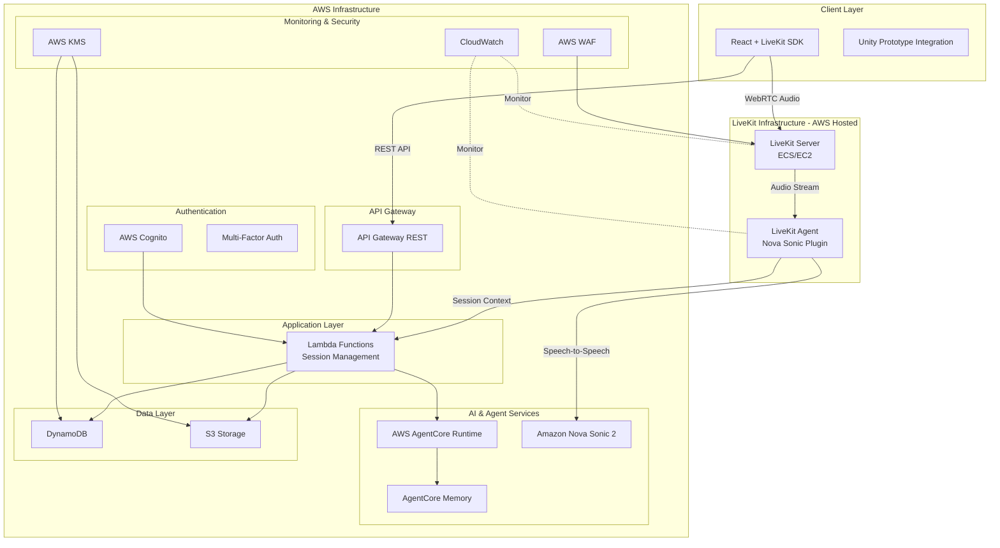
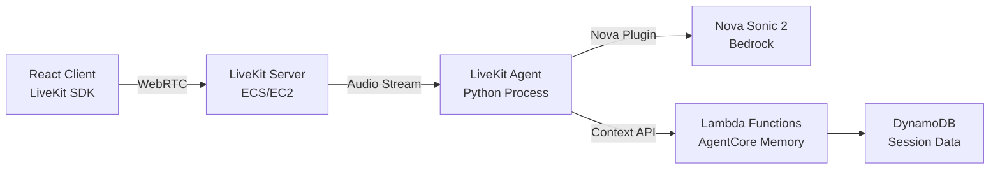

# Design Document: AI Therapy Platform

## Overview

The AI Therapy Platform is a secure, GDPR-compliant web application that enables real-time audio therapy sessions between clients and AI-powered therapists. The system leverages AWS AgentCore for AI agent management with persistent memory, Strands Agent SDK for conversation capabilities, and implements comprehensive safety features including red flag detection and therapist notifications.

The platform supports three user types (clients, therapists, admins) with role-based access controls, multi-language audio processing, and privacy-first design where therapists receive sentiment summaries rather than full conversation transcripts.

## Architecture

### High-Level Architecture (LiveKit-Enhanced)



### Regional Deployment

- **Primary Region**: US-West-2 (Oregon) - Hackathon deployment
- **Multi-AZ Deployment**: High availability across availability zones
- **Note**: GDPR compliance features commented out for hackathon scope

### LiveKit + Nova Sonic 2 Integration (Official AWS Pattern)

**LiveKit** is an open-source platform for building real-time voice, video, and AI applications. AWS has officially integrated Amazon Nova Sonic 2 with LiveKit Agents framework, providing a production-ready solution for voice AI applications.

**Key Benefits**:
- **Official AWS Integration**: Documented in [AWS Machine Learning Blog](https://aws.amazon.com/blogs/machine-learning/build-real-time-conversational-ai-experiences-using-amazon-nova-sonic-and-livekit/)
- **WebRTC-Based**: Industry-standard protocol for low-latency audio
- **Full-Duplex Audio**: Simultaneous speaking and listening
- **Built-in Features**: Voice activity detection, noise suppression, turn detection
- **No Custom Audio Pipelines**: LiveKit handles all audio routing and encoding
- **Open Source**: Can self-host on AWS (ECS/EC2) with no licensing fees

**LiveKit Architecture**:


**What LiveKit Provides**:
1. **Client SDKs**: React, TypeScript, mobile (iOS/Android)
2. **Server Infrastructure**: WebRTC SFU (Selective Forwarding Unit)
3. **Agent Framework**: Python-based agent orchestration
4. **Nova Sonic Plugin**: Official AWS Bedrock integration
5. **Session Management**: Automatic room and participant handling
6. **Audio Processing**: VAD, noise suppression, echo cancellation

**What We Still Build**:
1. **Therapeutic Logic**: AgentCore memory, session continuity
2. **Safety Features**: Red flag detection, guardrails
3. **User Management**: Cognito authentication, RBAC
4. **Data Persistence**: DynamoDB, session metadata
5. **Therapist Dashboard**: Notifications, sentiment summaries

**Deployment Options**:
- **Self-Hosted on AWS**: Deploy LiveKit server on ECS/EC2 (recommended for hackathon)
- **LiveKit Cloud**: Managed service (alternative, but self-hosted gives more control)

**Integration Flow**:
1. Client connects to LiveKit server via WebRTC
2. LiveKit agent starts with Nova Sonic plugin
3. Agent loads therapeutic context from Lambda/AgentCore
4. Audio streams through LiveKit → Agent → Nova Sonic
5. Agent applies safety guardrails and red flag detection
6. Session data persists to DynamoDB via Lambda
7. Therapist notifications trigger on red flags

### Hackathon Architecture Benefits (LiveKit-Enhanced)

**LiveKit Advantages**:
- **Production-Ready**: Battle-tested at scale by thousands of applications
- **Official AWS Support**: Documented integration with Nova Sonic 2
- **WebRTC Optimized**: Superior audio quality vs WebSocket-based solutions
- **Built-in Features**: VAD, noise suppression, turn detection included
- **Faster Development**: No need to build custom audio infrastructure
- **Open Source**: Self-host on AWS with full control

**Simplified Service Stack**:
- **LiveKit Server**: Handles all WebRTC audio routing (ECS/EC2)
- **LiveKit Agent**: Python process with Nova Sonic plugin
- **Nova Sonic 2**: Speech-to-speech AI model (Bedrock)
- **AgentCore Memory**: Session continuity and context
- **Lambda Functions**: Business logic and orchestration
- **DynamoDB**: Session metadata and user data
- **Cognito**: Authentication and user management

**Development Speed Optimizations**:
- **React + LiveKit SDK**: Pre-built audio components
- **No Custom WebSockets**: LiveKit handles all real-time communication
- **No Audio Pipeline**: LiveKit manages encoding/decoding
- **Focus on Therapeutic Features**: Spend time on what matters
- **Fewer Integration Points**: Simpler architecture = faster development
- **Managed Services**: Auto-scaling without infrastructure complexity

**Time Savings vs Custom Implementation**:
- ❌ **Eliminated**: Custom WebSocket handlers (~8 hours)
- ❌ **Eliminated**: Audio streaming protocol design (~6 hours)
- ❌ **Eliminated**: Audio buffering/chunking logic (~4 hours)
- ❌ **Eliminated**: Connection management complexity (~4 hours)
- ✅ **Retained**: All therapeutic AI logic (your core value)
- ✅ **Retained**: Safety and red flag detection
- ✅ **Retained**: Memory and session continuity

**Estimated Time Saved**: 20-25 hours of audio infrastructure work

### React Frontend Architecture (LiveKit-Enhanced)

**Component Structure**:
```
src/
├── components/
│   ├── auth/              # Login, registration, MFA
│   ├── client/            # Client session interface
│   │   └── LiveKitRoom.tsx  # LiveKit audio room component
│   ├── therapist/         # Therapist dashboard
│   ├── admin/             # Admin management panel
│   └── shared/            # Reusable UI components
├── hooks/
│   ├── useLiveKit.ts      # LiveKit room and connection management
│   ├── useAuth.ts         # Authentication state
│   └── useSession.ts      # Session state management
├── services/
│   ├── api.ts             # REST API client
│   ├── livekit.ts         # LiveKit service wrapper
│   └── agentcore.ts       # AgentCore integration
└── types/
    └── index.ts           # TypeScript type definitions
```

**Key React Hooks with LiveKit**:
- **useLiveKit**: Manages LiveKit room connections and audio state
- **useAuth**: Handles Cognito authentication and LiveKit token generation
- **useSession**: Manages therapy session state and AgentCore integration
- **useParticipant**: Tracks AI agent and user participation

**LiveKit React Components**:
```typescript
import { LiveKitRoom, useVoiceAssistant } from '@livekit/components-react';

// Simple therapy session component
function TherapySession() {
  const { token, roomName } = useLiveKitToken();
  
  return (
    <LiveKitRoom
      token={token}
      serverUrl="wss://your-livekit-server.com"
      connect={true}
      audio={true}
      video={false}
    >
      <VoiceAssistantUI />
    </LiveKitRoom>
  );
}
```

**Hackathon Development Benefits**:
- **Pre-built Components**: LiveKit provides audio UI components
- **Type Safety**: TypeScript + LiveKit SDK types
- **Hot Reloading**: Fast development iteration
- **No WebSocket Code**: LiveKit SDK handles everything
- **Focus on UX**: Spend time on therapeutic interface, not audio plumbing

## Components and Interfaces

### 1. Authentication Service

**Technology**: AWS Cognito User Pools with MFA

**Responsibilities**:
- User registration and verification
- Multi-factor authentication (SMS, Email, TOTP)
- JWT token management
- Role-based access control (RBAC)
- Password reset and account recovery

**Key Features**:
- <!-- GDPR-compliant user management (commented out for hackathon) -->
- Adaptive authentication for risk detection
- Integration with external identity providers
- Session management with configurable timeouts

### 2. Web Application Frontend

**Technology**: React + TypeScript with LiveKit SDK

**Responsibilities**:
- User interface for all three user types (client, therapist, admin)
- Real-time audio communication via LiveKit WebRTC
- Session management and history display
- Role-specific dashboards and controls

**Key Libraries for Hackathon**:
- **React**: Component-based UI development
- **TypeScript**: Type safety for faster development
- **@livekit/components-react**: Pre-built LiveKit UI components
- **@livekit/rtc-client**: LiveKit WebRTC client
- **React Router**: Client-side routing
- **Material-UI or Tailwind CSS**: Rapid UI development
- **React Query**: API state management

**Key Components**:
- **Client Interface**: LiveKit room, audio controls, conversation history
- **Therapist Dashboard**: Sentiment summaries, red flag notifications, client monitoring
- **Admin Panel**: User management, system configuration, analytics
- **LiveKit Room**: WebRTC audio session with AI agent
- **Unity Integration**: Wrapper components for existing Unity prototype elements

### 3. LiveKit Server Infrastructure

**Technology**: LiveKit Server (self-hosted on AWS ECS/EC2)

**Responsibilities**:
- WebRTC SFU (Selective Forwarding Unit) for audio routing
- Room and participant management
- Connection state management
- Audio quality optimization
- Load balancing across multiple agents

**Deployment**:
- **ECS Fargate**: Containerized LiveKit server (recommended)
- **EC2**: Alternative for more control
- **Auto-scaling**: Based on concurrent sessions
- **Health Checks**: CloudWatch monitoring

**Configuration**:
```yaml
# livekit.yaml
port: 7880
rtc:
  port_range_start: 50000
  port_range_end: 60000
  use_external_ip: true
redis:
  address: your-elasticache-endpoint:6379
keys:
  api_key: your-api-key
  api_secret: your-api-secret
```

### 4. LiveKit Agent with Nova Sonic Plugin

**Technology**: Python + LiveKit Agents SDK + AWS Bedrock Plugin

**Responsibilities**:
- Voice AI agent orchestration
- Nova Sonic 2 integration for speech-to-speech
- Therapeutic context loading from AgentCore
- Safety guardrails and red flag detection
- Session state management

**Agent Structure**:
```python
from livekit.agents import AutoSubscribe, JobContext, WorkerOptions, cli
from livekit.plugins import aws

async def entrypoint(ctx: JobContext):
    # Load therapeutic context from AgentCore
    context = await load_therapeutic_context(ctx.room.name)
    
    # Initialize Nova Sonic with therapeutic prompts
    assistant = aws.VoiceAssistant(
        model="amazon.nova-sonic-v1:0",
        system_prompt=context.therapeutic_prompt,
        temperature=0.7
    )
    
    # Apply safety guardrails
    assistant.on("speech", lambda text: check_red_flags(text))
    
    # Start the assistant
    assistant.start(ctx.room)
    
    # Persist session data
    await ctx.wait_for_participant()
    await persist_session_data(ctx.room.name)
```

**Key Features**:
- **Turn Detection**: Automatic detection of when user stops speaking
- **Context Management**: Loads/saves AgentCore memory
- **Safety Monitoring**: Real-time red flag detection
- **Multi-language**: Automatic language detection via Nova Sonic
- **Therapeutic Prompts**: Custom system prompts for therapy context

### 5. API Gateway (REST)

**Technology**: AWS API Gateway REST API

**Responsibilities**:
- REST API endpoints for session management
- LiveKit token generation
- User profile management
- Therapist dashboard APIs
- Admin management endpoints

**Key Endpoints**:
- `POST /sessions/create` - Create new therapy session and LiveKit room
- `GET /sessions/{id}` - Get session details and history
- `POST /livekit/token` - Generate LiveKit access token
- `GET /therapist/notifications` - Get red flag notifications
- `POST /admin/users` - User management

**Security Features**:
- AWS WAF integration for DDoS protection
- Cognito authorizer for JWT validation
- Rate limiting per user/IP
- Request validation and sanitization

### 6. Application Backend (Serverless)

**Technology**: AWS Lambda Functions + API Gateway

**Responsibilities**:
- Session orchestration and metadata management
- LiveKit room creation and token generation
- Red flag notification dispatch
- Sentiment analysis processing
- AgentCore memory coordination

**Key Lambda Functions**:
- **Session Manager**: Creates LiveKit rooms, manages session lifecycle
- **Token Generator**: Issues LiveKit access tokens with proper permissions
- **Context Loader**: Loads therapeutic context for LiveKit agent
- **Red Flag Handler**: Processes red flag events from agent
- **Notification Service**: Sends alerts to therapists
- **Analytics Service**: Generates session summaries

**Benefits for Hackathon**:
- **Serverless**: No infrastructure management
- **Auto-scaling**: Handles load automatically
- **Fast deployment**: Quick iteration and updates
- **Cost-effective**: Pay per execution

### 7. AI Agent Integration

**Technology**: AWS AgentCore Runtime + LiveKit Agents

**Responsibilities**:
- AI agent lifecycle management via LiveKit
- Conversation context persistence in AgentCore
- Therapeutic response generation via Nova Sonic
- Guardrails and safety filtering

**AgentCore Memory Integration**:
- Persistent conversation context across sessions
- Therapeutic progress tracking
- Personalized response adaptation
- Long-term memory management

### 8. Data Storage and Management (Serverless)

**Technology**: Amazon DynamoDB + Amazon S3

**Data Architecture**:
- **DynamoDB**: User profiles, session metadata, sentiment summaries, red flags
- **S3**: Session recordings (encrypted), system logs, backups
- **ElastiCache Redis** (optional): LiveKit room state caching

**DynamoDB Table Design**:
- **Users Table**: User profiles, roles, preferences (PK: userId)
- **Sessions Table**: Session metadata, LiveKit room info, sentiment summaries (PK: sessionId, SK: timestamp)
- **RedFlags Table**: Safety incidents and notifications (PK: sessionId, SK: flagId)
- **Notifications Table**: Therapist and admin alerts (PK: recipientId, SK: timestamp)
- **LiveKitRooms Table**: Active room tracking (PK: roomName, TTL for auto-cleanup)

**Hackathon Benefits**:
- **Serverless**: No database management or provisioning
- **Auto-scaling**: Handles any load automatically
- **Fast Setup**: Create tables in minutes
- **Pay-per-Use**: Only pay for actual reads/writes
- **Built-in Security**: Encryption at rest included

**Encryption**:
- Data at rest: AES-256 encryption (DynamoDB and S3)
- Data in transit: TLS 1.3 (LiveKit WebRTC is encrypted)
- Key management: AWS KMS

<!-- GDPR Compliance Features (commented out for hackathon):
- Data residency controls
- Right to erasure implementation
- Data export functionality
- Consent management
-->

## Data Models (DynamoDB Optimized)

### LiveKitRooms Table (New)
```typescript
interface LiveKitRoom {
  roomName: string;         // Partition Key (format: session_{sessionId})
  sessionId: string;
  clientId: string;
  agentId: string;
  status: 'active' | 'completed';
  createdAt: string;        // ISO timestamp
  ttl: number;              // Unix timestamp for auto-cleanup (24 hours)
  livekitToken: string;     // Encrypted token
  participantCount: number;
}
```

### Users Table
```typescript
interface User {
  userId: string;           // Partition Key
  email: string;
  role: 'client' | 'therapist' | 'admin';
  profile: UserProfile;
  preferences: UserPreferences;
  createdAt: string;        // ISO timestamp
  updatedAt: string;        // ISO timestamp
  isActive: boolean;
  mfaEnabled: boolean;
  languagePreference: string;
  GSI1PK?: string;          // For email-based queries
}

interface UserProfile {
  firstName: string;
  lastName: string;
  timezone: string;
  phoneNumber?: string;
  emergencyContact?: EmergencyContact;
}

interface UserPreferences {
  language: string;
  voiceSettings: VoiceSettings;
  notificationSettings: NotificationSettings;
  privacySettings: PrivacySettings;
}
```

### Sessions Table
```typescript
interface TherapySession {
  sessionId: string;        // Partition Key
  timestamp: string;        // Sort Key (ISO timestamp)
  clientId: string;
  agentId: string;
  status: 'active' | 'completed' | 'terminated';
  startTime: string;
  endTime?: string;
  duration?: number;
  language: string;
  metadata: SessionMetadata;
  sentimentSummary: SentimentSummary;
  agentMemoryId: string;    // AgentCore memory reference
  GSI1PK: string;          // clientId for client-based queries
  GSI1SK: string;          // timestamp for sorting
}

interface SessionMetadata {
  audioQuality: AudioQualityMetrics;
  connectionMetrics: ConnectionMetrics;
  therapeuticMilestones: string[];
  exercisesCompleted: string[];
}

interface SentimentSummary {
  overallSentiment: 'positive' | 'neutral' | 'negative';
  emotionalState: string[];
  progressIndicators: ProgressIndicator[];
  keyTopics: string[];
  riskLevel: 'low' | 'medium' | 'high';
  generatedAt: string;
}
```

### RedFlags Table
```typescript
interface RedFlag {
  sessionId: string;        // Partition Key
  flagId: string;          // Sort Key (timestamp-based)
  type: 'self_harm' | 'suicidal_ideation' | 'abuse' | 'violence' | 'crisis';
  severity: 'low' | 'medium' | 'high' | 'critical';
  detectedAt: string;
  context: string;         // Sanitized context, not full transcript
  notificationsSent: NotificationRecord[];
  resolved: boolean;
  resolvedBy?: string;
  resolvedAt?: string;
  GSI1PK: string;         // For therapist queries
  GSI1SK: string;         // severity + timestamp for prioritization
}

interface NotificationRecord {
  recipientId: string;
  method: 'email' | 'sms' | 'push' | 'in_app';
  sentAt: string;
  acknowledged: boolean;
  acknowledgedAt?: string;
}
```

### Notifications Table
```typescript
interface Notification {
  recipientId: string;      // Partition Key (therapist/admin ID)
  timestamp: string;        // Sort Key
  type: 'red_flag' | 'session_complete' | 'system_alert';
  priority: 'low' | 'medium' | 'high' | 'urgent';
  title: string;
  message: string;
  relatedSessionId?: string;
  relatedFlagId?: string;
  read: boolean;
  readAt?: string;
  actionRequired: boolean;
}
```

### DynamoDB Access Patterns

**Users Table**:
- Get user by ID: `userId` (PK)
- Get user by email: GSI on `email`

**Sessions Table**:
- Get session by ID: `sessionId` (PK)
- Get client sessions: GSI on `clientId` (GSI1PK) + `timestamp` (GSI1SK)
- Get recent sessions: Query by `timestamp` range

**RedFlags Table**:
- Get session red flags: `sessionId` (PK)
- Get therapist red flags: GSI on therapist assignment
- Get urgent flags: GSI on `severity` + `timestamp`

**Notifications Table**:
- Get user notifications: `recipientId` (PK) + `timestamp` (SK)
- Get unread notifications: Filter on `read = false`

### AgentCore Memory Model
```typescript
interface AgentMemory {
  memoryId: string;
  clientId: string;
  conversationContext: ConversationContext;
  therapeuticProfile: TherapeuticProfile;
  lastUpdated: Date;
  retentionPolicy: RetentionPolicy;
}

interface ConversationContext {
  sessionHistory: SessionSummary[];
  ongoingTopics: string[];
  therapeuticGoals: string[];
  progressNotes: ProgressNote[];
  personalityAdaptations: PersonalityAdaptation[];
}

interface TherapeuticProfile {
  communicationStyle: string;
  preferredApproaches: string[];
  triggersToAvoid: string[];
  successfulInterventions: string[];
  culturalConsiderations: string[];
}
```

Now I need to use the prework tool to analyze the acceptance criteria before writing the correctness properties:

<function_calls>
<invoke name="prework">
<parameter name="featureName">ai-therapy-platform

## Correctness Properties

*A property is a characteristic or behavior that should hold true across all valid executions of a system—essentially, a formal statement about what the system should do. Properties serve as the bridge between human-readable specifications and machine-verifiable correctness guarantees.*

### Property 1: User Registration and Authentication
*For any* user registration request with valid email and password, the system should create an account with proper email verification, assign exactly one of the three valid roles (client, therapist, admin), and issue valid JWT tokens upon successful authentication.
**Validates: Requirements 1.1, 1.2, 1.3**

### Property 2: Multi-Factor Authentication Enforcement
*For any* user when MFA is enabled, the system should require additional authentication factors for all user types and validate MFA tokens before granting access.
**Validates: Requirements 1.4**

### Property 3: Data Management (Hackathon Scope)
*For any* user account deletion request, the system should remove associated data while maintaining audit logs of the deletion process.
<!-- GDPR 30-day requirement commented out for hackathon -->
**Validates: Requirements 1.6**

### Property 4: Real-Time WebSocket Communication
*For any* client session initiation, API Gateway WebSockets should establish persistent connections with sub-200ms latency, maintain continuous audio streaming through Lambda functions, and gracefully handle connection issues with automatic reconnection.
**Validates: Requirements 2.1, 2.2, 2.6, 2.7**

### Property 5: Nova Sonic 2 Audio Processing
*For any* audio input, Nova Sonic 2 should provide real-time speech-to-speech processing with therapeutic context, natural turn-taking, multi-language support, and cultural sensitivity in a single integrated service.
**Validates: Requirements 2.3, 2.4, 2.5, 10.1, 10.2, 10.3, 10.4**

### Property 6: AgentCore Memory Integration
*For any* therapy session, the system should load previous conversation context from AgentCore memory at session start and store updated context at session end, maintaining therapeutic continuity across multiple sessions.
**Validates: Requirements 3.3, 3.6, 3.7, 7.1, 7.2**

### Property 7: Safety Guardrails and Filtering
*For any* client input containing inappropriate content, the system should apply guardrails to filter harmful responses and ensure AI responses follow therapeutic best practices.
**Validates: Requirements 3.5**

### Property 8: Comprehensive Red Flag Detection
*For any* client input containing self-harm indicators, suicidal ideation, or mentions of abuse/violence, the system should immediately flag the content, notify assigned therapists through multiple channels, log incidents with proper context, and escalate to admin users when multiple red flags occur.
**Validates: Requirements 4.1, 4.2, 4.3, 4.4, 4.5, 4.6**

### Property 9: Role-Based Access Control
*For any* user login, the system should provide access only to features appropriate for their role (client: sessions and history; therapist: sentiment summaries and red flags without transcripts; admin: full system management), enforce access restrictions, and update permissions immediately when roles change.
**Validates: Requirements 5.1, 5.2, 5.3, 5.4, 5.5, 5.6**

### Property 10: Audit Logging
*For any* administrative action or permission change, the system should maintain comprehensive audit logs with timestamps and user identification.
**Validates: Requirements 5.7**

### Property 11: Data Encryption and Security
*For any* data transmission or storage operation, the system should encrypt data in transit using TLS 1.3 and data at rest using AES-256 encryption.
**Validates: Requirements 6.1, 6.2**

### Property 12: Data Export (Hackathon Scope)
*For any* user data export request, the system should provide available personal data in machine-readable format.
<!-- GDPR compliance timeframes commented out for hackathon -->
**Validates: Requirements 6.3**

### Property 13: Session Sentiment Analysis
*For any* completed therapy session, the system should generate AI-powered sentiment analysis and progress summaries accessible to therapists while maintaining session metadata including timestamps, duration, and therapeutic milestones.
**Validates: Requirements 7.3, 7.5**

### Property 14: Data Retention Policy Enforcement
*For any* stored session data, the system should automatically apply data retention policies while preserving AgentCore memory necessary for therapeutic continuity.
**Validates: Requirements 7.6**

### Property 15: Infrastructure Auto-Scaling
*For any* increase in user demand or session load, the system should automatically scale resources to maintain performance and support zero-downtime deployments.
**Validates: Requirements 8.4, 8.6**

### Property 16: Responsive Web Interface
*For any* device type (desktop or mobile), the web application should provide responsive design and role-appropriate interfaces (client session management, therapist dashboards, admin system management).
**Validates: Requirements 9.1, 9.3, 9.4, 9.5**

### Property 17: Language Preference Persistence
*For any* user language preference setting, the system should maintain the preference across sessions and prompt for confirmation when language detection is uncertain.
**Validates: Requirements 10.5, 10.6**

### Property 18: Comprehensive API Security
*For any* API request, the system should validate authentication and authorization, implement rate limiting with appropriate error responses and temporary blocking for excessive requests, proxy external API calls to protect keys, and log requests for audit purposes without storing sensitive content.
**Validates: Requirements 11.1, 11.2, 11.3, 11.4, 11.5, 11.6**

## Error Handling

### Authentication Errors
- **Invalid Credentials**: Return standardized error responses without revealing user existence
- **MFA Failures**: Implement progressive delays and account lockout after repeated failures
- **Token Expiration**: Automatic refresh with graceful fallback to re-authentication
- **Session Timeout**: Clear client state and redirect to login with session restoration

### Audio Communication Errors
- **Connection Failures**: Automatic reconnection with exponential backoff
- **Nova Sonic 2 Failures**: Graceful degradation with error messages and session recovery
- **Audio Quality Issues**: Dynamic quality adjustment based on network conditions
- **Language Detection Failures**: Nova Sonic 2 built-in fallback to English with user notification

### AI Agent Errors
- **AgentCore Unavailability**: Graceful degradation with cached responses and service restoration
- **Memory Access Failures**: Fallback to session-only context with error logging
- **Response Generation Failures**: Fallback responses and escalation to human therapist
- **Guardrail Violations**: Immediate session suspension and therapist notification

### Data Processing Errors
- **Database Connection Issues**: Connection pooling with automatic failover
- **Encryption Failures**: Immediate service suspension and security team notification
- **Storage Capacity Issues**: Automatic scaling with cost monitoring and alerts
- **Backup Failures**: Multiple backup strategies with integrity verification

### Red Flag Processing Errors
- **Detection Service Failures**: Fallback to rule-based detection with manual review
- **Notification Failures**: Multiple delivery channels with retry mechanisms
- **Escalation Failures**: Direct admin notification and emergency protocols
- **False Positive Handling**: Therapist review and feedback loop for model improvement

## Testing Strategy

### Dual Testing Approach

The AI Therapy Platform requires both **unit testing** and **property-based testing** to ensure comprehensive coverage and correctness validation.

**Unit Tests** focus on:
- Specific authentication flows and edge cases
- Individual API endpoint functionality
- Database operations and data validation
- Integration points between services
- Error handling scenarios
- GDPR compliance workflows

**Property-Based Tests** focus on:
- Universal properties that hold across all inputs
- Security and privacy guarantees
- Performance characteristics under load
- Multi-language processing accuracy
- Role-based access control enforcement
- Data encryption and integrity

### Property-Based Testing Configuration

**Testing Framework**: Jest with fast-check for TypeScript/Node.js components

**Test Configuration**:
- Minimum 100 iterations per property test
- Custom generators for realistic test data (users, sessions, audio samples)
- Shrinking enabled for minimal counterexample identification
- Parallel execution for performance optimization

**Property Test Tagging**:
Each property-based test must include a comment referencing its design document property:
```typescript
// Feature: ai-therapy-platform, Property 1: User Registration and Authentication
```

### Testing Data Generators

**User Data Generators**:
- Valid/invalid email formats
- Password strength variations
- Role assignments (client, therapist, admin)
- Multi-language preferences
- MFA configurations

**Session Data Generators**:
- Audio samples for Nova Sonic 2 testing
- Conversation contexts of varying lengths
- Red flag content patterns
- Network condition simulations
- Load testing scenarios

**Security Testing Generators**:
- JWT token variations (valid, expired, malformed)
- API request patterns (normal, excessive, malicious)
- Encryption key rotations
- GDPR compliance scenarios

### Integration Testing

**End-to-End Scenarios**:
- Complete therapy session workflows
- Multi-user concurrent sessions
- Red flag detection and notification flows
- Data export and deletion processes
- Cross-language communication scenarios

**External Service Integration**:
- AWS AgentCore memory operations
- Strands Agent SDK conversation flows
- Amazon Nova Sonic 2 real-time audio processing
- Cognito authentication and MFA
- API Gateway WebSocket communication

### Performance Testing

**Load Testing Scenarios**:
- Concurrent user sessions (100, 500, 1000+ users)
- Audio streaming under network constraints
- Database performance under high query loads
- Memory usage during extended sessions
- Auto-scaling trigger validation

**Latency Requirements**:
- Nova Sonic 2 audio processing < 200ms
- API response times < 100ms
- Database query performance < 50ms
- Memory loading from AgentCore < 500ms
- Red flag detection and notification < 2 seconds

### Security Testing

**Penetration Testing**:
- Authentication bypass attempts
- Authorization escalation testing
- Data encryption validation
- API security assessment
- Network security evaluation

**GDPR Compliance Testing** (Commented out for hackathon):
<!-- 
- Data export completeness verification
- Data deletion effectiveness validation
- Consent management workflows
- Cross-border data transfer compliance
- Audit trail completeness
-->

### Monitoring and Observability

**Application Metrics**:
- Session success rates and duration
- Audio quality metrics and latency
- Red flag detection accuracy
- User engagement patterns
- System performance indicators

**Security Metrics**:
- Authentication failure rates
- Unauthorized access attempts
- Data encryption status
- Compliance audit results
- Incident response times

**Business Metrics**:
- User satisfaction scores
- Therapeutic outcome indicators
- Platform adoption rates
- Cost per session analysis
- Therapist workload distribution